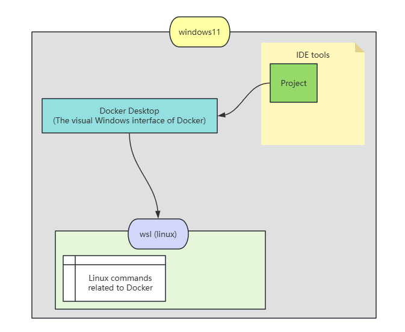
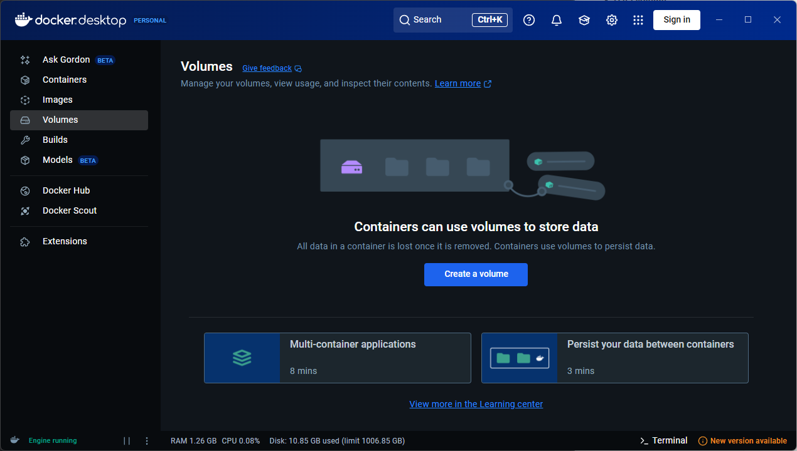
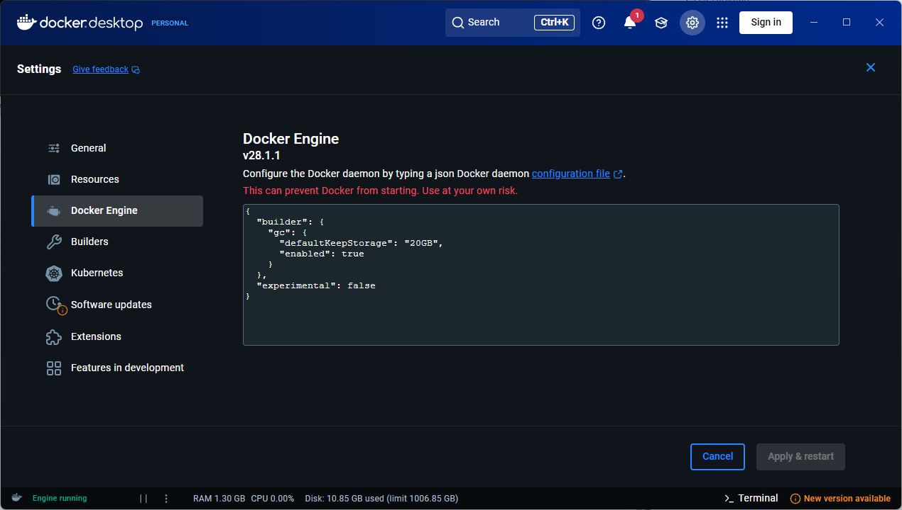
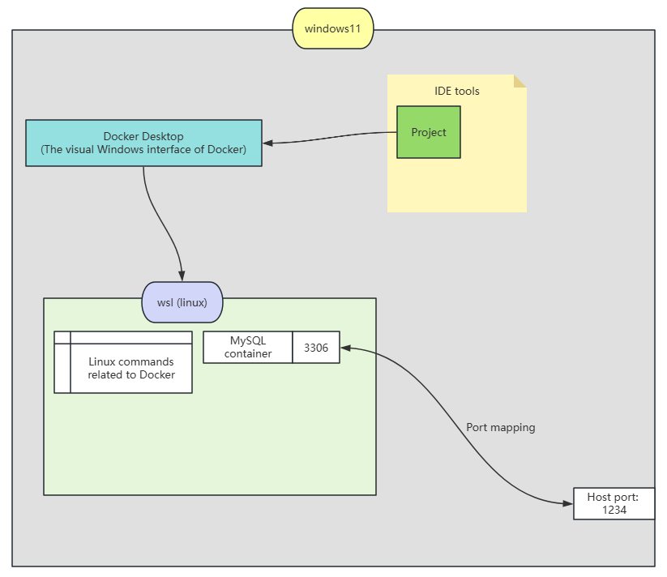

# Docker Desktop

> **Open Source License**: [windows 下玩转 Docker Desktop]([Window下玩转Docker Desktop_哔哩哔哩_bilibili](https://www.bilibili.com/video/BV19z421Y7Nn/?spm_id_from=333.337.search-card.all.click&vd_source=91e9878676c7a5f3f24d1d4fb2cba597))

## Introduction to Docker

### 1. Quickly start the application environment

Docker provides us with a convenient method to install development  environments, allowing us to install development environments on our computers in a way similar to installing software from an app store on our phones.

We use virtualization technology to obtain image files of the development environment, and through Docker tools, we can share/download the development environment.

The source of docker images:

+ docker store: [Docker Hub](https://hub.docker.com)
+ self: We can also create our own Docker images, which are similar to operating system image files. (the principle is the same)

### 2. Images Vs Containers

In operating systems, we typically use an image file to boot the operating system. Similarly, in Docker, this can be understood in the same way; the executable file that is run after the image is loaded is called a container.

Therefore, for an image file, we can launch multiple groups of virtualization runtime environments. In other words, one image file can support multiple containers.

### 3. Data volume

A data volume refers to the data that needs to be preserved during container operation. We can specify to save this data generated by the running container.

## Quick Start

### 1. Configure the image file*

You can configure the Docker image source in the "Docker Engine" to use the "Chinese mirrors," and you can also use the "Linux Mirrors" to globally configure the image sources for Linux and Docker.

+ Where is "Docker Engine"?   `docker desktop => setting => Docker Engine`

> After clicking to open Docker Desktop, the system will start the Docker Engine, and we can still use Docker commands in the Terminal.

+ Where is "Linux Mirrors"?  [一键脚本使换源更简单 - Linux Mirrors](https://linuxmirrors.cn/)

### 2. Start a container

First, search for the corresponding image files on DockerHub, then use the `pull` command to download the images. Additionally, we can use the `build` command to create an image from a Dockerfile.

After obtaining the image, you can use the `run` command to start a container. You can configure the container name, host port, and environment variables. For example, with a database, you can set its password using environment variables, and use the host port to map to a port number on the host machine.

## Usage Tips

### 1. How to modify container configuration

If we want to modify an existing container, how should we proceed? In Docker Desktop, containers are typically stored on a virtual disk. We can access a container's configuration file (.cnf) through: `Container => Files => etc => [container name]`, then modify it accordingly.

> The actual installation location of Docker Containers and the Linux system is:
> `'C:\Users\Free\AppData\Local\Docker\wsl\disk'`

